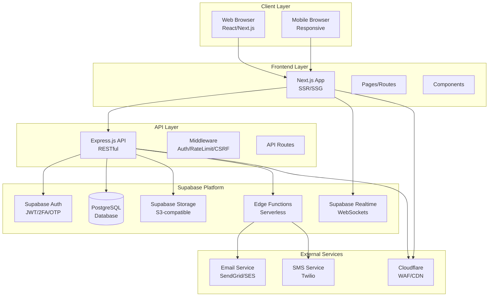

# منصة باكورة الاستثمارية - وثيقة البنية المعمارية
## Bakurah Investors Portal - Architecture Document

**الإصدار:** 1.0  
**التاريخ:** 2024-11-06  
**الحالة:** Draft

---

## Change Log

| Date | Version | Description | Author |
|------|---------|-------------|--------|
| 2024-11-06 | 1.0 | إنشاء Architecture Document الأولي | BMad Team |

---

## Introduction

### Starter Template or Existing Project

**N/A** - المشروع سيتم إنشاؤه من الصفر (Greenfield) باستخدام:
- Next.js App Router كـ starter template للـ Frontend
- Express.js كـ Backend framework
- Supabase كـ Backend-as-a-Service

### Introduction Content

هذه الوثيقة توضح البنية المعمارية الشاملة لمنصة باكورة الاستثمارية، بما في ذلك الأنظمة الخلفية والخدمات المشتركة والاهتمامات غير المتعلقة بواجهة المستخدم. الهدف الأساسي هو أن تكون بمثابة المخطط المعماري الموجه للتطوير الموجه بالذكاء الاصطناعي، مما يضمن الاتساق والالتزام بالأنماط والتقنيات المختارة.

**العلاقة مع Frontend Architecture:**
هذا المشروع يتضمن واجهة مستخدم مهمة. سيتم استخدام Next.js مع React.js للواجهة الأمامية. الخيارات التقنية الأساسية الموثقة هنا (انظر "Tech Stack") نهائية للمشروع بأكمله، بما في ذلك مكونات الواجهة الأمامية.

---

## High Level Architecture

### Technical Summary

منصة باكورة الاستثمارية هي نظام Monolith حديث مبني على Supabase كـ Backend-as-a-Service، مع Next.js للواجهة الأمامية وExpress.js للـ API Layer. البنية تستخدم Supabase Auth للمصادقة، Supabase Storage لتخزين الملفات، وSupabase Realtime للتحديثات الفورية. النظام مصمم كـ Monorepo مع فصل واضح بين Frontend وBackend. البنية تدعم RBAC (Role-Based Access Control) مع Row Level Security في Supabase، وتستخدم State Machine لإدارة دورة حياة الطلبات. النظام مصمم ليكون قابلاً للتوسع وقابلاً للتحويل إلى Microservices عند الحاجة.

### High Level Overview

**البنية المعمارية:**
- **النمط المعماري:** Monolith مع إمكانية التحويل إلى Microservices لاحقاً
- **هيكل المستودع:** Monorepo (Frontend + Backend في نفس المستودع)
- **بنية الخدمة:** Monolith مع طبقات واضحة (API Layer, Service Layer, Data Layer)
- **تدفق البيانات:** Client → Next.js Frontend → Express API → Supabase → PostgreSQL

**القرارات المعمارية الرئيسية:**

1. **Supabase كـ BaaS:** يوفر قاعدة بيانات، مصادقة، تخزين، وrealtime في حل واحد متكامل
2. **Next.js للـ Frontend:** SSR وSSG للأداء والـ SEO
3. **Express.js للـ API:** طبقة API خفيفة للعمليات المعقدة وBusiness Logic
4. **Monorepo:** سهولة إدارة الكود والتطوير المشترك
5. **State Machine:** إدارة دورة حياة الطلبات بشكل منظم وآمن

### High Level Project Diagram



---

## Tech Stack

### Frontend

- **Framework:** Next.js 14+ (App Router)
- **UI Library:** React 18+
- **Styling:** Tailwind CSS + CSS Modules
- **State Management:** React Context + Zustand (للحالة المعقدة)
- **Forms:** React Hook Form + Zod (للتحقق)
- **i18n:** next-intl (للعربية والإنجليزية)
- **HTTP Client:** Axios + Supabase Client
- **Charts:** Recharts أو Chart.js
- **Date Handling:** date-fns
- **File Upload:** react-dropzone

### Backend

- **Runtime:** Node.js 18+ LTS
- **Framework:** Express.js 4.18+
- **Language:** TypeScript
- **API Style:** RESTful API
- **Validation:** Zod + express-validator
- **Error Handling:** Custom error middleware
- **Logging:** Winston + Pino
- **Queue:** BullMQ (للعمليات غير المتزامنة)

### Database & Storage

- **Database:** Supabase (PostgreSQL 15+)
- **ORM/Query Builder:** Supabase Client (PostgREST)
- **Migrations:** Supabase Migrations + MCP
- **Storage:** Supabase Storage (S3-compatible)
- **Backup:** Supabase Automated Backups

### Authentication & Security

- **Auth Provider:** Supabase Auth
- **Session Management:** Supabase JWT + Refresh Tokens
- **2FA:** TOTP (Time-based One-Time Password)
- **Password Hashing:** Supabase (Argon2)
- **CSRF Protection:** csurf middleware
- **Rate Limiting:** express-rate-limit
- **Security Headers:** helmet.js

### Real-time & Notifications

- **Real-time:** Supabase Realtime (WebSockets)
- **Email:** Supabase Auth Email Templates + Edge Functions
- **SMS:** Twilio أو Supabase SMS (إن أمكن)
- **Push Notifications:** Web Push API (لاحقاً)

### DevOps & Infrastructure

- **Containerization:** Docker + Docker Compose
- **CI/CD:** GitHub Actions
- **Deployment:** Vercel (Frontend) + Railway/Render (Backend) + Supabase Cloud
- **Monitoring:** Supabase Dashboard + Prometheus + Grafana
- **Logging:** Supabase Logs + ELK Stack
- **Error Tracking:** Sentry
- **WAF/CDN:** Cloudflare

### Development Tools

- **Package Manager:** npm أو pnpm
- **Code Quality:** ESLint + Prettier
- **Type Checking:** TypeScript
- **Testing:** Jest + React Testing Library + Supertest
- **E2E Testing:** Playwright (اختياري)
- **API Documentation:** Swagger/OpenAPI
- **Version Control:** Git + GitHub

---

## Project Structure

```
invastors-bacura/
├── .github/
│   └── workflows/          # CI/CD pipelines
├── .bmad-core/             # BMad framework files
├── docs/                   # Documentation
│   ├── prd/               # PRD and Epics
│   ├── architecture/      # Architecture docs
│   ├── stories/          # User Stories
│   └── qa/               # QA documents
├── frontend/              # Next.js Frontend
│   ├── app/              # App Router pages
│   ├── components/       # React components
│   ├── lib/              # Utilities and helpers
│   ├── hooks/            # Custom React hooks
│   ├── store/            # State management
│   ├── styles/           # Global styles
│   └── public/           # Static assets
├── backend/              # Express.js Backend
│   ├── src/
│   │   ├── routes/       # API routes
│   │   ├── controllers/ # Route handlers
│   │   ├── services/     # Business logic
│   │   ├── middleware/   # Express middleware
│   │   ├── models/       # Data models
│   │   ├── utils/        # Utilities
│   │   └── types/        # TypeScript types
│   ├── tests/            # Backend tests
│   └── migrations/       # Database migrations
├── shared/               # Shared code between frontend/backend
│   ├── types/            # Shared TypeScript types
│   └── constants/        # Shared constants
├── supabase/             # Supabase configuration
│   ├── migrations/       # Supabase migrations
│   ├── functions/        # Edge Functions
│   └── config.toml      # Supabase config
├── docker/               # Docker files
├── .env.example         # Environment variables template
├── package.json         # Root package.json (workspace)
├── docker-compose.yml   # Local development setup
└── README.md            # Project README
```

---

## Database Schema

### Core Tables

#### users
```sql
CREATE TABLE users (
  id UUID PRIMARY KEY DEFAULT gen_random_uuid(),
  email VARCHAR(255) UNIQUE NOT NULL,
  phone VARCHAR(20),
  phone_cc VARCHAR(5),
  role VARCHAR(20) NOT NULL DEFAULT 'investor',
  status VARCHAR(20) NOT NULL DEFAULT 'pending',
  mfa_enabled BOOLEAN DEFAULT FALSE,
  mfa_secret VARCHAR(255),
  created_at TIMESTAMP WITH TIME ZONE DEFAULT NOW(),
  updated_at TIMESTAMP WITH TIME ZONE DEFAULT NOW()
);
```

#### investor_profiles
```sql
CREATE TABLE investor_profiles (
  id UUID PRIMARY KEY DEFAULT gen_random_uuid(),
  user_id UUID REFERENCES users(id) ON DELETE CASCADE,
  id_type VARCHAR(50),
  id_number VARCHAR(100),
  nationality VARCHAR(100),
  city VARCHAR(100),
  country VARCHAR(100),
  kyc_status VARCHAR(20) DEFAULT 'pending',
  language VARCHAR(10) DEFAULT 'ar',
  notification_preferences JSONB DEFAULT '{}',
  created_at TIMESTAMP WITH TIME ZONE DEFAULT NOW(),
  updated_at TIMESTAMP WITH TIME ZONE DEFAULT NOW(),
  UNIQUE(user_id)
);
```

#### requests
```sql
CREATE TABLE requests (
  id UUID PRIMARY KEY DEFAULT gen_random_uuid(),
  request_number VARCHAR(50) UNIQUE NOT NULL,
  user_id UUID REFERENCES users(id) ON DELETE CASCADE,
  type VARCHAR(10) NOT NULL CHECK (type IN ('buy', 'sell')),
  amount DECIMAL(15,2) NOT NULL CHECK (amount > 0),
  currency VARCHAR(10) NOT NULL DEFAULT 'SAR',
  target_price DECIMAL(15,2),
  expiry_at TIMESTAMP WITH TIME ZONE,
  status VARCHAR(20) NOT NULL DEFAULT 'draft',
  notes TEXT,
  created_at TIMESTAMP WITH TIME ZONE DEFAULT NOW(),
  updated_at TIMESTAMP WITH TIME ZONE DEFAULT NOW()
);

CREATE INDEX idx_requests_user_id ON requests(user_id);
CREATE INDEX idx_requests_status ON requests(status);
CREATE INDEX idx_requests_created_at ON requests(created_at);
CREATE INDEX idx_requests_request_number ON requests(request_number);
```

#### request_events
```sql
CREATE TABLE request_events (
  id UUID PRIMARY KEY DEFAULT gen_random_uuid(),
  request_id UUID REFERENCES requests(id) ON DELETE CASCADE,
  from_status VARCHAR(20),
  to_status VARCHAR(20) NOT NULL,
  actor_id UUID REFERENCES users(id),
  note TEXT,
  created_at TIMESTAMP WITH TIME ZONE DEFAULT NOW()
);

CREATE INDEX idx_request_events_request_id ON request_events(request_id);
CREATE INDEX idx_request_events_created_at ON request_events(created_at);
```

#### attachments
```sql
CREATE TABLE attachments (
  id UUID PRIMARY KEY DEFAULT gen_random_uuid(),
  request_id UUID REFERENCES requests(id) ON DELETE CASCADE,
  filename VARCHAR(255) NOT NULL,
  mime_type VARCHAR(100),
  size BIGINT,
  storage_key VARCHAR(500) NOT NULL,
  created_at TIMESTAMP WITH TIME ZONE DEFAULT NOW()
);

CREATE INDEX idx_attachments_request_id ON attachments(request_id);
```

#### roles
```sql
CREATE TABLE roles (
  id UUID PRIMARY KEY DEFAULT gen_random_uuid(),
  name VARCHAR(50) UNIQUE NOT NULL,
  description TEXT,
  created_at TIMESTAMP WITH TIME ZONE DEFAULT NOW()
);
```

#### permissions
```sql
CREATE TABLE permissions (
  id UUID PRIMARY KEY DEFAULT gen_random_uuid(),
  name VARCHAR(100) UNIQUE NOT NULL,
  resource VARCHAR(100) NOT NULL,
  action VARCHAR(50) NOT NULL,
  created_at TIMESTAMP WITH TIME ZONE DEFAULT NOW()
);
```

#### role_permissions
```sql
CREATE TABLE role_permissions (
  role_id UUID REFERENCES roles(id) ON DELETE CASCADE,
  permission_id UUID REFERENCES permissions(id) ON DELETE CASCADE,
  PRIMARY KEY (role_id, permission_id)
);
```

#### user_roles
```sql
CREATE TABLE user_roles (
  user_id UUID REFERENCES users(id) ON DELETE CASCADE,
  role_id UUID REFERENCES roles(id) ON DELETE CASCADE,
  PRIMARY KEY (user_id, role_id)
);
```

#### news
```sql
CREATE TABLE news (
  id UUID PRIMARY KEY DEFAULT gen_random_uuid(),
  title VARCHAR(500) NOT NULL,
  slug VARCHAR(500) UNIQUE NOT NULL,
  body_md TEXT NOT NULL,
  cover_key VARCHAR(500),
  category VARCHAR(50),
  status VARCHAR(20) NOT NULL DEFAULT 'draft',
  scheduled_at TIMESTAMP WITH TIME ZONE,
  published_at TIMESTAMP WITH TIME ZONE,
  author_id UUID REFERENCES users(id),
  created_at TIMESTAMP WITH TIME ZONE DEFAULT NOW(),
  updated_at TIMESTAMP WITH TIME ZONE DEFAULT NOW()
);

CREATE INDEX idx_news_status ON news(status);
CREATE INDEX idx_news_published_at ON news(published_at);
CREATE INDEX idx_news_slug ON news(slug);
```

#### notifications
```sql
CREATE TABLE notifications (
  id UUID PRIMARY KEY DEFAULT gen_random_uuid(),
  user_id UUID REFERENCES users(id) ON DELETE CASCADE,
  type VARCHAR(50) NOT NULL,
  channel VARCHAR(20) NOT NULL,
  payload JSONB NOT NULL,
  read_at TIMESTAMP WITH TIME ZONE,
  created_at TIMESTAMP WITH TIME ZONE DEFAULT NOW()
);

CREATE INDEX idx_notifications_user_id ON notifications(user_id);
CREATE INDEX idx_notifications_read_at ON notifications(read_at);
CREATE INDEX idx_notifications_created_at ON notifications(created_at);
```

#### notification_preferences
```sql
CREATE TABLE notification_preferences (
  user_id UUID REFERENCES users(id) ON DELETE CASCADE,
  channel VARCHAR(20) NOT NULL,
  type VARCHAR(50) NOT NULL,
  enabled BOOLEAN DEFAULT TRUE,
  PRIMARY KEY (user_id, channel, type)
);
```

#### audit_logs
```sql
CREATE TABLE audit_logs (
  id UUID PRIMARY KEY DEFAULT gen_random_uuid(),
  actor_id UUID REFERENCES users(id),
  action VARCHAR(100) NOT NULL,
  target_type VARCHAR(50),
  target_id UUID,
  diff JSONB,
  ip_address INET,
  user_agent TEXT,
  created_at TIMESTAMP WITH TIME ZONE DEFAULT NOW()
);

CREATE INDEX idx_audit_logs_actor_id ON audit_logs(actor_id);
CREATE INDEX idx_audit_logs_target ON audit_logs(target_type, target_id);
CREATE INDEX idx_audit_logs_created_at ON audit_logs(created_at);
```

### Database Functions & Triggers

#### Generate Request Number
```sql
CREATE OR REPLACE FUNCTION generate_request_number()
RETURNS TRIGGER AS $$
BEGIN
  NEW.request_number := 'INV-' || TO_CHAR(NOW(), 'YYYY') || '-' || 
    LPAD(NEXTVAL('request_number_seq')::TEXT, 6, '0');
  RETURN NEW;
END;
$$ LANGUAGE plpgsql;

CREATE SEQUENCE request_number_seq START 1;

CREATE TRIGGER set_request_number
  BEFORE INSERT ON requests
  FOR EACH ROW
  EXECUTE FUNCTION generate_request_number();
```

#### Update Updated At
```sql
CREATE OR REPLACE FUNCTION update_updated_at_column()
RETURNS TRIGGER AS $$
BEGIN
  NEW.updated_at = NOW();
  RETURN NEW;
END;
$$ LANGUAGE plpgsql;

CREATE TRIGGER update_users_updated_at
  BEFORE UPDATE ON users
  FOR EACH ROW
  EXECUTE FUNCTION update_updated_at_column();

CREATE TRIGGER update_requests_updated_at
  BEFORE UPDATE ON requests
  FOR EACH ROW
  EXECUTE FUNCTION update_updated_at_column();
```

---

## API Design

### API Structure

**Base URL:** `/api/v1`

### Authentication Endpoints

- `POST /api/v1/auth/register` - تسجيل مستثمر جديد
- `POST /api/v1/auth/verify-otp` - التحقق من OTP
- `POST /api/v1/auth/login` - تسجيل الدخول
- `POST /api/v1/auth/refresh` - تحديث الجلسة
- `POST /api/v1/auth/logout` - تسجيل الخروج
- `POST /api/v1/auth/2fa/setup` - إعداد 2FA
- `POST /api/v1/auth/2fa/verify` - التحقق من 2FA
- `POST /api/v1/auth/2fa/disable` - تعطيل 2FA

### Investor Endpoints

- `GET /api/v1/investor/profile` - الحصول على الملف الشخصي
- `PATCH /api/v1/investor/profile` - تحديث الملف الشخصي
- `GET /api/v1/investor/dashboard` - لوحة التحكم
- `GET /api/v1/investor/requests` - قائمة الطلبات
- `POST /api/v1/investor/requests` - إنشاء طلب جديد
- `GET /api/v1/investor/requests/:id` - تفاصيل الطلب
- `POST /api/v1/investor/requests/:id/submit` - إرسال الطلب
- `POST /api/v1/investor/requests/:id/files/presign` - Presigned URL للرفع

### Admin Endpoints

- `GET /api/v1/admin/users` - قائمة المستخدمين
- `POST /api/v1/admin/users` - إنشاء مستخدم جديد
- `PATCH /api/v1/admin/users/:id/status` - تغيير حالة المستخدم
- `POST /api/v1/admin/users/:id/reset-password` - إعادة تعيين كلمة المرور
- `GET /api/v1/admin/requests` - صندوق وارد الطلبات
- `GET /api/v1/admin/requests/:id` - تفاصيل الطلب
- `PATCH /api/v1/admin/requests/:id/approve` - قبول الطلب
- `PATCH /api/v1/admin/requests/:id/reject` - رفض الطلب
- `POST /api/v1/admin/requests/:id/request-info` - طلب معلومات إضافية
- `POST /api/v1/admin/requests/:id/comments` - إضافة تعليق
- `PATCH /api/v1/admin/requests/:id/settle` - معالجة الطلب
- `GET /api/v1/admin/dashboard/stats` - إحصائيات لوحة التحكم
- `GET /api/v1/admin/reports/requests` - تقارير الطلبات
- `GET /api/v1/admin/audit-logs` - سجل التدقيق

### Content Management Endpoints

- `GET /api/v1/news` - قائمة الأخبار (عام)
- `GET /api/v1/news/:id` - تفاصيل الخبر
- `GET /api/v1/admin/news` - إدارة الأخبار
- `POST /api/v1/admin/news` - إنشاء خبر جديد
- `PATCH /api/v1/admin/news/:id` - تحديث الخبر
- `DELETE /api/v1/admin/news/:id` - حذف الخبر
- `POST /api/v1/admin/news/:id/publish` - نشر الخبر
- `POST /api/v1/admin/news/:id/approve` - الموافقة على الخبر
- `POST /api/v1/admin/news/images/presign` - Presigned URL للصور

### Notifications Endpoints

- `GET /api/v1/notifications` - قائمة الإشعارات
- `PATCH /api/v1/notifications/:id/read` - تحديد كمقروء
- `POST /api/v1/notifications/mark-all-read` - تحديد الكل كمقروء
- `GET /api/v1/notifications/preferences` - تفضيلات الإشعارات
- `PATCH /api/v1/notifications/preferences` - تحديث التفضيلات

---

## Security Architecture

### Authentication Flow

1. المستخدم يسجل أو يسجل دخول
2. Supabase Auth يتحقق من Credentials
3. Supabase يرجع JWT Token + Refresh Token
4. Frontend يحفظ Tokens في Secure HttpOnly Cookies
5. كل Request يحتوي على JWT في Header
6. Middleware يتحقق من Token ويستخرج User Info

### Authorization (RBAC)

- **Investor:** يمكنه الوصول لطلباته وملفه الشخصي فقط
- **Admin:** وصول كامل لجميع الوظائف الإدارية (معالجة الطلبات، إدارة المستخدمين، إدارة المحتوى، التقارير، سجل التدقيق)

### Row Level Security (RLS)

جميع الجداول تستخدم RLS Policies في Supabase:

```sql
-- مثال: المستخدمون يقرأون إشعاراتهم فقط
CREATE POLICY "Users can read their own notifications"
ON notifications
FOR SELECT
USING (auth.uid() = user_id);

-- مثال: المستخدمون يقرأون طلباتهم فقط
CREATE POLICY "Users can read their own requests"
ON requests
FOR SELECT
USING (auth.uid() = user_id);
```

### Security Best Practices

1. **HTTPS Only:** جميع الاتصالات عبر HTTPS
2. **CORS:** تكوين CORS بشكل صارم
3. **Rate Limiting:** 100 requests/minute لكل IP
4. **Input Validation:** Zod validation على جميع المدخلات
5. **SQL Injection:** استخدام Parameterized Queries فقط
6. **XSS Protection:** Content Security Policy (CSP)
7. **CSRF Protection:** CSRF tokens للـ state-changing operations
8. **Security Headers:** Helmet.js للـ security headers

---

## State Management

### Request State Machine

```
Draft → Submitted → Screening → [Pending Info | Compliance Review] → Approved/Rejected → Settling → Completed
```

**التحولات المسموحة:**
- Draft → Submitted (المستثمر)
- Submitted → Screening (تلقائي)
- Screening → Pending Info (الأدمن)
- Screening → Compliance Review (الأدمن)
- Screening → Approved/Rejected (الأدمن)
- Pending Info → Screening (المستثمر يرد)
- Compliance Review → Approved/Rejected (الأدمن)
- Approved → Settling (الأدمن)
- Settling → Completed (الأدمن)

---

## Error Handling

### Error Response Format

```json
{
  "error": {
    "code": "ERROR_CODE",
    "message": "Human readable message",
    "details": {},
    "timestamp": "2024-11-06T10:00:00Z"
  }
}
```

### Error Codes

- `VALIDATION_ERROR` - خطأ في التحقق من البيانات
- `AUTHENTICATION_ERROR` - خطأ في المصادقة
- `AUTHORIZATION_ERROR` - خطأ في الصلاحيات
- `NOT_FOUND` - المورد غير موجود
- `CONFLICT` - تعارض في البيانات
- `RATE_LIMIT_EXCEEDED` - تجاوز حد الطلبات
- `INTERNAL_ERROR` - خطأ داخلي في الخادم

---

## Testing Strategy

### Unit Testing

- **Frontend:** Jest + React Testing Library
- **Backend:** Jest + Supertest
- **Coverage Target:** 80%+

### Integration Testing

- **API Tests:** Supertest + Test Database
- **Database Tests:** Supabase Test Instance
- **E2E Tests:** Playwright (للمسارات الحرجة)

### Testing Best Practices

1. **Test Isolation:** كل test مستقل
2. **Mock External Services:** Mock Supabase Client في Tests
3. **Test Data:** استخدام Factories للـ Test Data
4. **CI Integration:** تشغيل Tests في CI Pipeline

---

## Deployment Architecture

### Development Environment

- **Local:** Docker Compose
- **Database:** Supabase Local Development
- **Frontend:** Next.js Dev Server
- **Backend:** Express Dev Server

### Staging Environment

- **Frontend:** Vercel Preview Deployments
- **Backend:** Railway Staging
- **Database:** Supabase Staging Project
- **Storage:** Supabase Storage

### Production Environment

- **Frontend:** Vercel Production
- **Backend:** Railway Production
- **Database:** Supabase Production
- **CDN/WAF:** Cloudflare
- **Monitoring:** Supabase Dashboard + Sentry

---

## Monitoring & Logging

### Logging Strategy

1. **Application Logs:** Winston/Pino
2. **Access Logs:** Express Morgan
3. **Error Logs:** Sentry
4. **Database Logs:** Supabase Logs
5. **Audit Logs:** Database Table

### Monitoring Metrics

- **Performance:** Response Time, Throughput
- **Errors:** Error Rate, Error Types
- **Database:** Query Performance, Connection Pool
- **Storage:** Usage, Bandwidth
- **Auth:** Login Success Rate, 2FA Adoption

---

## Performance Considerations

### Frontend Optimization

- **Code Splitting:** Dynamic Imports
- **Image Optimization:** Next.js Image Component
- **Caching:** Static Generation حيث ممكن
- **Bundle Size:** Tree Shaking, Minification

### Backend Optimization

- **Database Indexes:** على جميع Foreign Keys وSearch Fields
- **Query Optimization:** استخدام Selects المحددة
- **Caching:** Redis للـ Frequently Accessed Data
- **Connection Pooling:** Supabase Connection Pool

### Database Optimization

- **Indexes:** على جميع Columns المستخدمة في WHERE وJOIN
- **Partitioning:** للجداول الكبيرة (audit_logs)
- **Archiving:** أرشفة البيانات القديمة

---

## Scalability Considerations

### Current Architecture (MVP)

- **Monolith:** مناسب حتى 10K مستخدم نشط
- **Single Database:** Supabase يدعم حتى 500MB
- **No Caching:** يمكن إضافة Redis لاحقاً

### Future Scalability

- **Microservices:** تقسيم إلى Services منفصلة
- **Database Sharding:** تقسيم البيانات
- **CDN:** Cloudflare للـ Static Assets
- **Load Balancing:** Multiple Backend Instances

---

## Next Steps

بعد الموافقة على هذا Architecture Document:
1. إنشاء Source Tree Document
2. إنشاء Coding Standards Document
3. إنشاء Tech Stack Document
4. البدء في تطوير Epic 1

