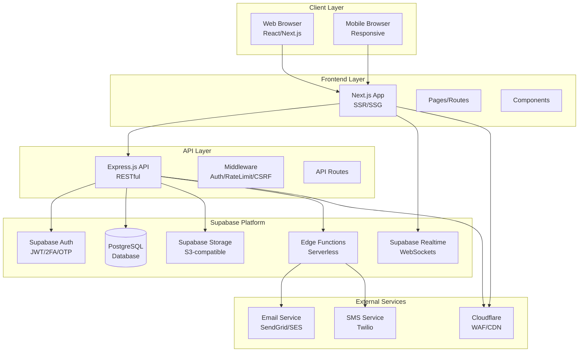

# High Level Architecture

### Technical Summary

منصة باكورة الاستثمارية هي نظام Monolith حديث مبني على Supabase كـ Backend-as-a-Service، مع Next.js للواجهة الأمامية وExpress.js للـ API Layer. البنية تستخدم Supabase Auth للمصادقة، Supabase Storage لتخزين الملفات، وSupabase Realtime للتحديثات الفورية. النظام مصمم كـ Monorepo مع فصل واضح بين Frontend وBackend. البنية تدعم RBAC (Role-Based Access Control) مع Row Level Security في Supabase، وتستخدم State Machine لإدارة دورة حياة الطلبات. النظام مصمم ليكون قابلاً للتوسع وقابلاً للتحويل إلى Microservices عند الحاجة.

### High Level Overview

**البنية المعمارية:**
- **النمط المعماري:** Monolith مع إمكانية التحويل إلى Microservices لاحقاً
- **هيكل المستودع:** Monorepo (Frontend + Backend في نفس المستودع)
- **بنية الخدمة:** Monolith مع طبقات واضحة (API Layer, Service Layer, Data Layer)
- **تدفق البيانات:** Client → Next.js Frontend → Express API → Supabase → PostgreSQL

**القرارات المعمارية الرئيسية:**

1. **Supabase كـ BaaS:** يوفر قاعدة بيانات، مصادقة، تخزين، وrealtime في حل واحد متكامل
2. **Next.js للـ Frontend:** SSR وSSG للأداء والـ SEO
3. **Express.js للـ API:** طبقة API خفيفة للعمليات المعقدة وBusiness Logic
4. **Monorepo:** سهولة إدارة الكود والتطوير المشترك
5. **State Machine:** إدارة دورة حياة الطلبات بشكل منظم وآمن

### High Level Project Diagram

