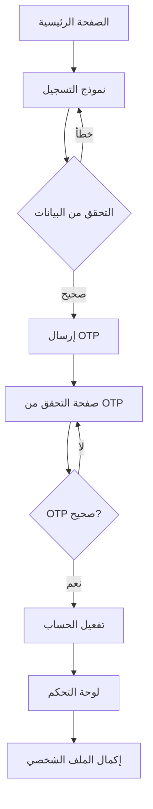
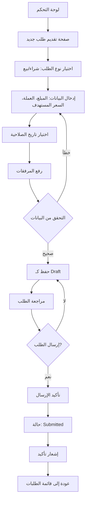
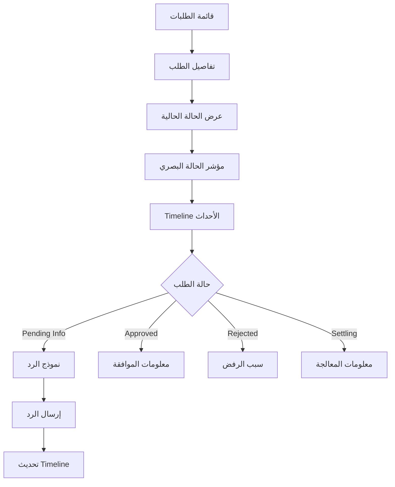
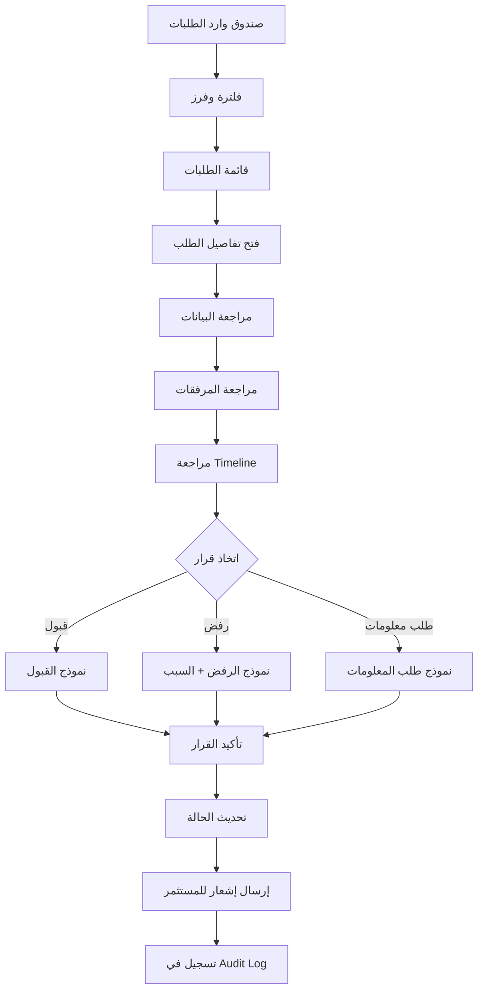
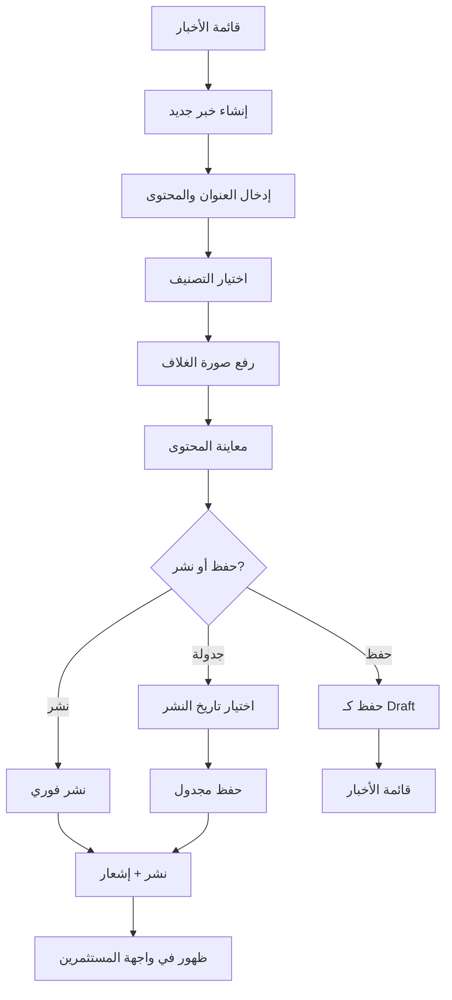

# منصة باكورة الاستثمارية - مواصفات واجهة المستخدم وتجربة الاستخدام
## Bakurah Investors Portal - UI/UX Specification

**الإصدار:** 1.0  
**التاريخ:** 2024-11-06  
**الحالة:** Draft

---

## Change Log

| Date | Version | Description | Author |
|------|---------|-------------|--------|
| 2024-11-06 | 1.0 | إنشاء Front End Spec الأولي | BMad Team |

---

## Introduction

هذه الوثيقة تحدد أهداف تجربة المستخدم، بنية المعلومات، تدفقات المستخدم، ومواصفات التصميم البصري لواجهة منصة باكورة الاستثمارية. تعمل كأساس للتصميم البصري وتطوير الواجهة الأمامية، مما يضمن تجربة متماسكة ومرتكزة على المستخدم.

### Design System Snapshot
- المرجع التفصيلي لنظام التصميم: `docs/design-system.md`.
- ملف الألوان والقيم المحوسبة: `frontend/src/styles/theme.ts`.
- مكوّن الشعار المعياري: `frontend/src/components/Logo.tsx` (يستخدم الأصل `frontend/src/assets/logo.jpg`).
- يلتزم النظام بتباين WCAG AA ويعتمد خط **Tajawal** للعربية مع دعم كامل لـ RTL.

---

## UX Goals & Principles

### Target User Personas

#### 1. المستثمر الفردي (Individual Investor)
- **الوصف:** مستثمر فردي يريد إدارة استثماراته بسهولة
- **الاحتياجات:** واجهة بسيطة وواضحة، خطوات محددة، متابعة سهلة للطلبات
- **المستوى التقني:** مبتدئ إلى متوسط
- **الأهداف:** تقديم طلبات بسرعة، متابعة حالة الاستثمارات

#### 2. المستثمر المؤسسي (Institutional Investor)
- **الوصف:** ممثل عن شركة أو مؤسسة استثمارية
- **الاحتياجات:** واجهة احترافية، تقارير مفصلة، إدارة متعددة المستخدمين
- **المستوى التقني:** متوسط إلى متقدم
- **الأهداف:** إدارة محفظة استثمارية، متابعة متعددة الطلبات

#### 3. الأدمن (Administrator)
- **الوصف:** موظف إداري في باكورة يدير المنصة
- **الاحتياجات:** أدوات إدارية شاملة، فلترة متقدمة، تقارير وإحصائيات
- **المستوى التقني:** متقدم
- **الأهداف:** معالجة الطلبات بسرعة، إدارة المستخدمين، نشر المحتوى

### Usability Goals

1. **سهولة التعلم:** المستخدمون الجدد يمكنهم إكمال المهام الأساسية خلال 5 دقائق
2. **كفاءة الاستخدام:** المستخدمون المتمرسون يمكنهم إكمال المهام المتكررة بأقل عدد من النقرات
3. **منع الأخطاء:** التحقق الواضح والتأكيد للإجراءات الحساسة
4. **القابلية للتذكر:** المستخدمون غير المنتظمين يمكنهم العودة دون إعادة التعلم
5. **الرضا:** تجربة استخدام ممتعة واحترافية تعزز الثقة في المنصة

### Design Principles

1. **الوضوح فوق الذكاء** - أولوية للتواصل الواضح على الابتكار الجمالي
2. **البساطة** - تقليل التعقيد، عرض ما هو ضروري فقط
3. **الاتساق** - استخدام نفس الأنماط والعناصر في جميع أنحاء المنصة
4. **الشفافية** - إظهار حالة النظام والإجراءات بوضوح
5. **الوصولية** - تصميم يمكن الوصول إليه لجميع المستخدمين (WCAG AA)
6. **الاستجابة** - عمل ممتاز على جميع الأجهزة (Desktop, Tablet, Mobile)
7. **الثقة** - تصميم يعزز الثقة في المنصة الاستثمارية

---

## Information Architecture

### Site Map

```
منصة باكورة الاستثمارية
│
├── الصفحة الرئيسية (Landing Page)
│   └── [عام - غير مسجل]
│
├── المصادقة
│   ├── تسجيل الدخول
│   ├── التسجيل
│   ├── التحقق من OTP
│   └── إعادة تعيين كلمة المرور
│
├── لوحة المستثمر (Investor Dashboard)
│   ├── نظرة عامة
│   ├── طلباتي
│   │   ├── قائمة الطلبات
│   │   ├── تفاصيل الطلب
│   │   └── تقديم طلب جديد
│   ├── ملفي الشخصي
│   ├── الإشعارات
│   └── الأخبار
│
└── لوحة الأدمن (Admin Dashboard)
    ├── نظرة عامة
    ├── صندوق وارد الطلبات
    │   ├── قائمة الطلبات
    │   └── تفاصيل الطلب (لوحة القرار)
    ├── إدارة المستخدمين
    ├── إدارة المحتوى
    │   ├── قائمة الأخبار
    │   ├── إنشاء/تعديل خبر
    │   └── التصنيفات
    ├── التقارير والإحصائيات
    └── سجل التدقيق
```

### Navigation Structure

#### للمستثمر
- **Header Navigation:**
  - Logo (رابط للصفحة الرئيسية)
  - القائمة الرئيسية: لوحة التحكم | طلباتي | الأخبار
  - Language Switcher (عربي/English)
  - Profile Menu (الملف الشخصي | الإشعارات | تسجيل الخروج)

- **Sidebar Navigation (في لوحة التحكم):**
  - نظرة عامة
  - طلباتي
  - ملفي الشخصي
  - الإشعارات
  - الأخبار

#### للأدمن
- **Header Navigation:**
  - Logo
  - القائمة الرئيسية: لوحة التحكم | الطلبات | المستخدمين | المحتوى | التقارير
  - Language Switcher
  - Profile Menu

- **Sidebar Navigation:**
  - نظرة عامة
  - صندوق وارد الطلبات
  - إدارة المستخدمين
  - إدارة المحتوى
  - التقارير والإحصائيات
  - سجل التدقيق

---

## User Flows

### Flow 1: تسجيل مستثمر جديد

**User Goal:** التسجيل في المنصة وإنشاء حساب جديد

**Entry Points:**
- زر "تسجيل مستثمر" في الصفحة الرئيسية
- رابط "إنشاء حساب" في صفحة تسجيل الدخول

**Success Criteria:**
- المستخدم يسجل بنجاح
- يتم إرسال OTP
- المستخدم يتحقق من OTP
- الحساب يتم تفعيله
- المستخدم يتم توجيهه إلى لوحة التحكم

**Flow Diagram:**



**Edge Cases & Error Handling:**
- OTP منتهي الصلاحية → إعادة إرسال OTP
- OTP خاطئ → رسالة خطأ واضحة
- البريد الإلكتروني موجود → رسالة "الحساب موجود بالفعل"
- اتصال الإنترنت منقطع → حفظ البيانات محلياً وإعادة المحاولة

**Notes:** العملية يجب أن تكون سريعة (أقل من 2 دقيقة). استخدام التحقق الفوري من صحة البيانات.

---

### Flow 2: تقديم طلب استثماري

**User Goal:** تقديم طلب شراء أو بيع جديد

**Entry Points:**
- زر "طلب جديد" في لوحة التحكم
- زر "تقديم طلب" في صفحة طلباتي

**Success Criteria:**
- المستخدم يملأ النموذج بنجاح
- يتم رفع المرفقات
- الطلب يتم حفظه كـ Draft
- المستخدم يرسل الطلب
- الطلب ينتقل إلى حالة Submitted
- يتم إرسال إشعار تأكيد

**Flow Diagram:**



**Edge Cases & Error Handling:**
- ملف أكبر من 10MB → رسالة خطأ مع الحد الأقصى
- نوع ملف غير مدعوم → رسالة مع الأنواع المدعومة
- تاريخ صلاحية في الماضي → منع الإرسال
- مبلغ غير صحيح → التحقق الفوري

**Notes:** النموذج يجب أن يكون في صفحة واحدة مع خطوات واضحة. استخدام Drag & Drop لرفع الملفات.

---

### Flow 3: متابعة حالة الطلب

**User Goal:** معرفة حالة طلب استثماري

**Entry Points:**
- قائمة الطلبات في لوحة التحكم
- إشعار عن تغيير الحالة
- رابط مباشر من البريد الإلكتروني

**Success Criteria:**
- المستخدم يرى حالة الطلب الحالية
- المستخدم يرى Timeline للأحداث
- المستخدم يمكنه رؤية المرفقات
- المستخدم يمكنه الرد على طلب معلومات إضافية

**Flow Diagram:**



**Edge Cases & Error Handling:**
- طلب محذوف → رسالة "الطلب غير موجود"
- عدم وجود صلاحيات → إعادة توجيه
- خطأ في تحميل البيانات → إعادة المحاولة

**Notes:** استخدام ألوان واضحة للحالات. Timeline يجب أن يكون تفاعلياً.

---

### Flow 4: معالجة طلب (للأدمن)

**User Goal:** مراجعة واتخاذ قرار على طلب

**Entry Points:**
- صندوق وارد الطلبات
- إشعار عن طلب جديد

**Success Criteria:**
- الأدمن يرى تفاصيل الطلب
- الأدمن يرى المرفقات
- الأدمن يرى Timeline
- الأدمن يتخذ قرار (قبول/رفض/طلب معلومات)
- يتم تحديث الحالة وإرسال إشعار

**Flow Diagram:**



**Edge Cases & Error Handling:**
- طلب تم معالجته بالفعل → رسالة تحذير
- مرفقات مفقودة → طلب معلومات
- بيانات غير مكتملة → طلب معلومات

**Notes:** لوحة القرار يجب أن تكون شاملة وسريعة. استخدام Shortcuts للقرارات الشائعة.

---

### Flow 5: نشر خبر جديد (للأدمن)

**User Goal:** إنشاء ونشر خبر أو إعلان

**Entry Points:**
- قائمة الأخبار → "إنشاء جديد"
- لوحة التحكم → "إدارة المحتوى"

**Success Criteria:**
- إنشاء خبر جديد
- إضافة المحتوى والصور
- معاينة قبل النشر
- نشر أو جدولة النشر
- ظهور الخبر في واجهة المستثمرين

**Flow Diagram:**



**Edge Cases & Error Handling:**
- محتوى فارغ → منع الحفظ
- صورة كبيرة → ضغط تلقائي
- تاريخ نشر في الماضي → رسالة خطأ

**Notes:** استخدام Markdown Editor للمحتوى. معاينة مباشرة أثناء الكتابة.

---

## Wireframes & Mockups

### Design Files Location

**Primary Design Tool:** Figma (موصى به) أو Sketch

**Design System:** سيتم إنشاء Design System مخصص بناءً على Brand Guidelines

### Key Screen Layouts

#### 1. الصفحة الرئيسية (Landing Page)

**Purpose:** صفحة ترحيبية للمستخدمين غير المسجلين

**Key Elements:**
- Header مع Logo وزر "تسجيل مستثمر"
- Hero Section مع عنوان رئيسي ووصف مختصر
- قسم الأخبار/الإعلانات الأخيرة (عنوان فقط)
- Footer مع روابط مهمة

**Interaction Notes:**
- زر "تسجيل مستثمر" بارز وواضح
- الأخبار قابلة للنقر للانتقال إلى صفحة التسجيل
- تصميم بسيط ونظيف

**Layout:**
```
┌─────────────────────────────────┐
│ Header: Logo | تسجيل مستثمر    │
├─────────────────────────────────┤
│                                   │
│     Hero Section                 │
│     (عنوان + وصف)                │
│                                   │
│     [زر تسجيل مستثمر]           │
│                                   │
├─────────────────────────────────┤
│     آخر الأخبار (عنوان فقط)     │
│     - خبر 1                      │
│     - خبر 2                      │
├─────────────────────────────────┤
│ Footer                           │
└─────────────────────────────────┘
```

---

#### 2. لوحة تحكم المستثمر (Investor Dashboard)

**Purpose:** نظرة عامة على حالة الاستثمارات والطلبات

**Key Elements:**
- Header مع Navigation وProfile Menu
- Cards للإحصائيات (إجمالي الطلبات، قيد المعالجة، مكتملة)
- قائمة الطلبات الأخيرة
- قسم الإشعارات غير المقروءة
- Sidebar للتنقل السريع

**Interaction Notes:**
- Cards قابلة للنقر للانتقال إلى التفاصيل
- Real-time updates للإشعارات
- Quick Actions للطلبات المعلقة

**Layout:**
```
┌─────────────────────────────────────────┐
│ Header: Logo | Nav | Profile            │
├──────────┬───────────────────────────────┤
│          │  Cards: Stats (3 columns)    │
│ Sidebar  ├───────────────────────────────┤
│          │  الطلبات الأخيرة             │
│ - نظرة   │  [Request 1] [Request 2]     │
│   عامة  │                               │
│ - طلباتي │  الإشعارات                   │
│ - ملفي   │  [Notification 1]            │
│ - إشعارات│  [Notification 2]             │
│          │                               │
└──────────┴───────────────────────────────┘
```

---

#### 3. صفحة تقديم طلب جديد

**Purpose:** نموذج لتقديم طلب استثماري جديد

**Key Elements:**
- Breadcrumb Navigation
- Form Sections:
  - نوع الطلب (Radio: شراء/بيع)
  - البيانات الأساسية (المبلغ، العملة، السعر المستهدف)
  - تاريخ الصلاحية (Date Picker)
  - رفع الملفات (Drag & Drop Zone)
  - ملاحظات (Textarea)
- Preview Section
- Action Buttons (حفظ كـ Draft، إرسال)

**Interaction Notes:**
- التحقق الفوري من البيانات
- Progress Indicator للرفع
- Preview للملفات المرفوعة
- Confirmation Modal قبل الإرسال

**Layout:**
```
┌─────────────────────────────────────────┐
│ ← طلباتي > طلب جديد                    │
├─────────────────────────────────────────┤
│                                         │
│  نوع الطلب: ○ شراء  ○ بيع             │
│                                         │
│  البيانات:                             │
│  [المبلغ] [العملة]                     │
│  [السعر المستهدف]                      │
│  [تاريخ الصلاحية]                      │
│                                         │
│  المرفقات:                             │
│  ┌─────────────────────┐               │
│  │  Drag & Drop Zone   │               │
│  │  أو انقر للاختيار   │               │
│  └─────────────────────┘               │
│                                         │
│  [File 1] [File 2]                      │
│                                         │
│  ملاحظات:                              │
│  [Textarea]                             │
│                                         │
│  [حفظ كـ Draft]  [إرسال الطلب]        │
└─────────────────────────────────────────┘
```

---

#### 4. صندوق وارد الطلبات (للأدمن)

**Purpose:** عرض وإدارة جميع الطلبات الواردة

**Key Elements:**
- Filters Bar (الحالة، النوع، التاريخ، البحث)
- Sort Options
- Table/List View للطلبات
- Pagination
- Bulk Actions (اختياري)

**Interaction Notes:**
- Filters تطبق فوراً
- Click على طلب لفتح لوحة القرار
- Badge للأولويات/الحالات
- Real-time updates للطلبات الجديدة

**Layout:**
```
┌─────────────────────────────────────────┐
│ Header: Logo | Nav | Profile            │
├─────────────────────────────────────────┤
│ Filters: [الحالة ▼] [النوع ▼] [بحث]   │
│ Sort: [التاريخ ▼] [المبلغ ▼]          │
├─────────────────────────────────────────┤
│ ┌─────┬──────────┬──────┬──────────┐   │
│ │رقم  │المستثمر │المبلغ│الحالة   │   │
│ ├─────┼──────────┼──────┼──────────┤   │
│ │INV- │أحمد     │10,000│Submitted │   │
│ │2024 │محمد     │5,000 │Screening │   │
│ └─────┴──────────┴──────┴──────────┘   │
│                                         │
│ [< Previous] [1] [2] [3] [Next >]     │
└─────────────────────────────────────────┘
```

---

#### 5. لوحة قرار الطلب (للأدمن)

**Purpose:** مراجعة شاملة للطلب واتخاذ قرار

**Key Elements:**
- Split View:
  - Left: بيانات الطلب + Timeline
  - Right: المرفقات + Quick Actions
- Action Buttons (قبول، رفض، طلب معلومات)
- Comments Section
- History Timeline

**Interaction Notes:**
- Scroll مستقل لكل قسم
- Preview للمرفقات
- Quick Actions في Fixed Position
- Auto-save للتعليقات

**Layout:**
```
┌─────────────────────────────────────────┐
│ ← صندوق وارد > طلب #INV-2024-0001     │
├──────────────┬──────────────────────────┤
│ بيانات الطلب│  المرفقات                │
│              │  ┌────────────┐          │
│ النوع: شراء │  │  File 1    │          │
│ المبلغ: 10K │  │  [Preview] │          │
│ العملة: SAR │  └────────────┘          │
│              │  ┌────────────┐          │
│ Timeline:    │  │  File 2    │          │
│ • Submitted  │  │  [Preview] │          │
│ • Screening  │  └────────────┘          │
│              │                          │
│ التعليقات:  │  Quick Actions:          │
│ [Textarea]   │  [قبول] [رفض]           │
│              │  [طلب معلومات]          │
└──────────────┴──────────────────────────┘
```

---

## Component Library / Design System

### Design System Approach

سيتم استخدام **Design System مخصص** مبني على Tailwind CSS مع مكونات shadcn/ui كأساس.

### Foundational Components

#### 1. Buttons

**States:**
- Default
- Hover
- Active
- Disabled
- Loading

**Variants:**
- Primary (أزرق)
- Secondary (رمادي)
- Success (أخضر)
- Danger (أحمر)
- Ghost (شفاف)

**Sizes:**
- Small
- Medium
- Large

#### 2. Forms

**Input Types:**
- Text Input
- Number Input
- Date Picker
- Select/Dropdown
- Textarea
- File Upload (Drag & Drop)

**States:**
- Default
- Focus
- Error
- Success
- Disabled

#### 3. Cards

**Types:**
- Stat Card (للإحصائيات)
- Content Card (للمحتوى)
- Request Card (للطلبات)

#### 4. Status Badges

**Colors:**
- Draft: رمادي
- Submitted: أزرق
- Screening: برتقالي
- Pending Info: أصفر
- Approved: أخضر
- Rejected: أحمر
- Settling: بنفسجي
- Completed: أخضر داكن

#### 5. Navigation

**Components:**
- Header Navigation
- Sidebar Navigation
- Breadcrumbs
- Tabs
- Pagination

#### 6. Feedback

**Components:**
- Alerts (Success, Error, Warning, Info)
- Toast Notifications
- Loading Spinners
- Progress Bars
- Empty States

#### 7. Data Display

**Components:**
- Tables
- Lists
- Timeline
- Charts/Graphs

---

## Visual Design Guidelines

### Color Palette

**Primary Colors:**
- Primary Blue: `#2563EB` (للأزرار الرئيسية والروابط)
- Primary Dark: `#1E40AF` (للـ Hover States)

**Secondary Colors:**
- Success Green: `#10B981`
- Warning Yellow: `#F59E0B`
- Error Red: `#EF4444`
- Info Blue: `#3B82F6`

**Neutral Colors:**
- Background: `#FFFFFF` / `#F9FAFB`
- Text Primary: `#111827`
- Text Secondary: `#6B7280`
- Border: `#E5E7EB`

**Status Colors:**
- Draft: `#9CA3AF`
- Submitted: `#3B82F6`
- Screening: `#F59E0B`
- Approved: `#10B981`
- Rejected: `#EF4444`

### Typography

**Font Family:**
- Arabic: "Cairo" أو "Tajawal"
- English: "Inter" أو "Roboto"

**Font Sizes:**
- H1: 32px / 2rem
- H2: 24px / 1.5rem
- H3: 20px / 1.25rem
- Body: 16px / 1rem
- Small: 14px / 0.875rem
- Caption: 12px / 0.75rem

**Font Weights:**
- Regular: 400
- Medium: 500
- Semi-bold: 600
- Bold: 700

### Spacing System

**Base Unit:** 4px

**Scale:**
- xs: 4px
- sm: 8px
- md: 16px
- lg: 24px
- xl: 32px
- 2xl: 48px
- 3xl: 64px

### Border Radius

- Small: 4px
- Medium: 8px
- Large: 12px
- Full: 9999px

### Shadows

- Small: `0 1px 2px rgba(0,0,0,0.05)`
- Medium: `0 4px 6px rgba(0,0,0,0.1)`
- Large: `0 10px 15px rgba(0,0,0,0.1)`

---

## Responsive Design

### Breakpoints

- Mobile: < 640px
- Tablet: 640px - 1024px
- Desktop: > 1024px

### Mobile-First Approach

- تصميم يبدأ من Mobile ثم يتوسع
- Navigation يتحول إلى Hamburger Menu على Mobile
- Tables تتحول إلى Cards على Mobile
- Forms تتحول إلى Full Width على Mobile

### Touch Targets

- Minimum Size: 44x44px
- Spacing بين العناصر: 8px minimum

---

## Accessibility (WCAG AA)

### Requirements

1. **Color Contrast:**
   - Text على Background: 4.5:1 minimum
   - Large Text: 3:1 minimum

2. **Keyboard Navigation:**
   - جميع العناصر قابلة للوصول عبر Keyboard
   - Focus Indicators واضحة

3. **Screen Readers:**
   - ARIA Labels لجميع العناصر التفاعلية
   - Semantic HTML
   - Alt Text للصور

4. **Text Alternatives:**
   - جميع الصور لها Alt Text
   - Icons لها Labels

---

## Internationalization (i18n)

### Supported Languages

- العربية (RTL)
- English (LTR)

### RTL Support

- Flip Layout للعربية
- Mirror Icons والـ UI Elements
- Date/Number Formatting حسب اللغة

### Translation Keys Structure

```
locales/
├── ar/
│   ├── common.json
│   ├── auth.json
│   ├── requests.json
│   ├── dashboard.json
│   └── admin.json
└── en/
    ├── common.json
    ├── auth.json
    ├── requests.json
    ├── dashboard.json
    └── admin.json
```

---

## Performance Considerations

### Loading States

- Skeleton Screens للبيانات
- Progressive Loading
- Lazy Loading للصور

### Optimization

- Code Splitting
- Image Optimization
- Font Optimization
- Caching Strategy

---

## Next Steps

بعد الموافقة على هذا Front End Spec:
1. إنشاء Design System في Figma
2. إنشاء Wireframes تفصيلية
3. إنشاء Mockups عالية الدقة
4. إنشاء Component Library
5. البدء في تطوير Frontend

---

## Design File References

**Figma File:** سيتم إنشاء ملف Figma منفصل يحتوي على:
- Design System
- Component Library
- Screen Mockups
- User Flow Diagrams

**Link:** سيتم إضافة الرابط بعد إنشاء الملف

